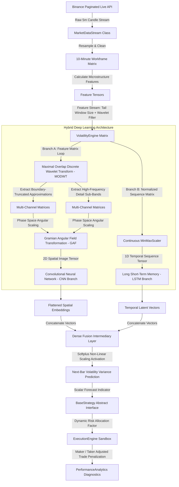

# Multi-Branch MODWT-CNN-LSTM Volatility Engine and Execution Sandbox

A real-time quantitative trading and volatility forecasting framework for digital assets. The system combines Maximal Overlap Discrete Wavelet Transforms (MODWT), Gramian Angular Field (GAF) transformations, Convolutional Neural Networks (CNN), and Long Short-Term Memory (LSTM) networks with an automated, fee-aware execution engine.

---

## Key Features

* **Dual-Branch Deep Learning:** Separates macro volatility trends from high-frequency market noise across two parallel network paths.
* **Asymmetric Risk Optimization:** Trained with a stabilized QLIKE loss function that penalizes underestimating volatility more than overestimating it, helping protect capital during sudden market expansions.
* **Paginated Historical Data Fetching:** Automatically splits large historical datasets (such as 3+ months or 13,000+ bars) into sequenced chunks via the Binance API to prevent memory issues and avoid rate limits.
* **Batch Inference Engine:** Runs feature processing and TensorFlow model inference in vectorized batches instead of slow, bar-by-bar iterative loops.
* **Modular OOP Design:** Uses abstract base classes to separate data fetching, feature engineering, model inference, strategy rules, and performance tracking. New strategies can be added without modifying the core system.
* **Fee and Order-Type Accounting:** Models realistic trading costs with distinct maker (limit: 0.02%) and taker (market: 0.05%) fee tiers to generate realistic equity curves.

---

## System Architecture

The pipeline processes raw 5-minute candles from Binance, resamples them to a 10-minute trading timeframe, constructs microstructure feature vectors, and feeds them into a dual-branch neural network.

## Deep Learning Framework Breakdown
**1. Feature Engineering and Microstructure Inputs**
The pipeline tracks six core price and volume features on every bar:

* log_returns: Logarithmic interval asset returns.

* garman_klass: Intraday variance estimator based on open, high, low, and close prices.

* log_range: Log high-to-low price expansion.

* volume_change: Period-over-period percentage shift in volume.

* close_open_gap: Gap between the current open and previous close.

* norm_close_pos: Relative position of the close within the high-low bar range.

**2. Time-Frequency Wavelet Decomposition (MODWT)**
Instead of passing raw price series directly to the model, the engine runs a Maximal Overlap Discrete Wavelet Transform (MODWT) using a db4 Daubechies mother wavelet. This separates each feature into trend components (approximations) and high-frequency noise components (details) without lookahead bias.

**3. Gramian Angular Fields (GAF)**
Wavelet outputs are converted into polar coordinates to map temporal correlations into 2D matrices. This allows the 2D CNN branch to evaluate time-series patterns as spatial structures while preserving sequential ordering.

**4. Direct Neural Fusion**
The CNN branch extracts spatial features from the GAF matrices, while the parallel LSTM branch processes the continuous normalized sequences to capture temporal dependencies. Their outputs are merged into a dense layer and passed through a Softplus activation to output a non-negative forecast for next-bar volatility variance.

## Codebase Structure
The codebase is organized into standalone components:

* MarketDataStream: Handles paginated data downloading, candle stitching, missing bar cleanup, and indicator engineering.

* VolatilityEngine: Manages the TensorFlow session, generates GAF matrices, and runs batched model inference (model(..., training=False)).

* BaseStrategy: Abstract base class defining the strategy contract. New strategies inherit from this class:

Python
class CustomStrategy(BaseStrategy):
    def generate_allocation_factor(self, predicted_vol, historical_context_df):
        # Implement custom sizing or entry logic here
        return allocation_weight  # Float between 0.0 and 1.0
ExecutionEngine: Simulates order fills, tracks cash versus asset positions, adjusts position sizing dynamically, and applies transaction fees.

PerformanceAnalytics: Calculates performance and risk metrics from backtest trade logs.

## Performance Analytics
The system logs trade performance across several core metrics:

Risk-Adjusted Returns: Sharpe Ratio, Sortino Ratio (downside deviation), and Calmar Ratio.

Drawdown and Reliability: Maximum Drawdown (MDD), Recovery Factor, Profit Factor, and Win Rate.

Forecast Accuracy: Correlation between realized and predicted volatility (Information Coefficient).

## Model Training and Benchmark Results

### Dataset and Setup
* Asset and Timeframe: Binance ETH/USDT 10-minute candles
* Training Period: 2024 to 2025 (~105,120 bars)
* Out-of-Sample Test Window: H1 2026 (25,550 bars)
* Target Metric: Next-step Garman-Klass volatility prediction
* Loss Function: Asymmetric QLIKE Loss

### Predictive Engine Benchmarks
Models evaluated across the out-of-sample dataset (H1 2026) assessing volatility forecasting accuracy before feeding into trading logic.

| Model Architecture | Mean QLIKE Loss | Volatility Correlation | Role |
| :--- | :---: | :---: | :--- |
| GARCH(1,1) Baseline | 0.661454 | 0.6117 | Econometric Baseline |
| Hybrid GAF-CNN-LSTM | 0.642872 | 0.6214 | Deep Learning Squeeze Gate |
| Ensemble (50.7% NN + 49.3% GARCH) | **0.620735** | **0.6506** | Best Statistical Score |

#### The Ensemble Paradox
Even though the ensemble model hit the lowest statistical QLIKE loss (0.6207) and highest correlation (0.6506), it did not deliver higher backtest returns when plugged into the trading strategy.

The GARCH component smoothed out short-term volatility drops and added a slight lag to the rolling percentile rankings. This caused the ensemble to trigger entry gates late during sudden compression breakdowns. On the other hand, the standalone neural network caught raw non-linear spatial cues from the GASF images and triggered entries right at maximum price compression, giving better entry timing and a higher net return (+14.06%).

---

## Strategy Execution and Backtest Performance

### Strategy Variants
1. Strategy 1 (Clean Baseline Taker): Executes using market taker orders (0.05% fee).
Strategy 1 triggers immediate market taker orders as soon as the neural network detects a volatility squeeze breakout. By accepting the higher taker fee, the system guarantees instant order execution without waiting in the order book. This ensures full participation in fast-moving price expansions before the spread widens or price gaps away.
2. Strategy 2 (Post-Only Maker Simulation): Uses a 0.02% post-only limit fee assumption to cut down transaction costs.
Strategy 2 replaces market taker orders with passive post-only limit orders placed at the bid-ask boundary to lower transaction fees. It relies on liquidity provision, waiting for incoming market orders to fill the positions passively. However, this introduces adverse selection mechanics, as fast breakout moves tend to leave limit orders unfilled while false breakouts fill resting bids before reversing.

3. Strategy 3 (Stabilized Anti-Chop Variant): Defensive taker model that cuts position size in half after a loss and adds a breakeven timer if momentum stalls.
Strategy 3 adds risk management controls designed to mitigate losses during sideways and choppy market conditions. It dynamically reduces position sizing by half following any losing trade and enforces a breakeven exit timer if directional momentum stalls. This structural modification limits capital exposure during regime transitions while maintaining systematic signal triggers.

### Out-of-Sample Backtest Results (H1 2026)

| Metric | Strategy 1 (Taker) | Strategy 2 (Post-Maker) | Strategy 3 (Anti-Chop) |
| :--- | :---: | :---: | :---: |
| Net Return | **+14.06%** | +12.86% | +5.43% |
| Max Drawdown | -10.00% | **-7.94%** | **-3.95%** |
| Sharpe Ratio (Ann.) | 1.55 | **1.76** | 1.04 |
| Profit Factor | 1.08 | **1.11** | 1.09 |
| Win Rate | 42.4% | **43.2%** | 38.6% |
| Trade Count | 66 | 44 | 44 |
| Total Exchange Fees | 8.22% (0.05% Taker) | **2.23%** (0.02% Maker) | 3.85% (0.05% Taker) |
| Execution Type | Market Taker | Post-Only Limit | Adaptive Taker |

---

### Monthly Net Return Breakdown (2026 Out-of-Sample)

| Month | Strategy 1 (Taker) | Strategy 2 (Post-Maker) | Strategy 3 (Anti-Chop) |
| :--- | :---: | :---: | :---: |
| Jan 2026 | +0.00% | +0.00% | +0.00% |
| Feb 2026 | -2.32% | -3.41% | -1.81% |
| Mar 2026 | +13.74% | +3.74% | -0.06% |
| Apr 2026 | +0.33% | +3.56% | +3.01% |
| May 2026 | +1.15% | +2.70% | +0.11% |
| Jun 2026 | -7.81% | -6.43% | -2.98% |
| Jul 2026 | +8.97% | +12.70% | +7.16% |
| **Total** | **+14.06%** | **+12.86%** | **+5.43%** |

---

### Strategy Analysis and Microstructure Takeaways

1. Strategy 1 Performance: Paying the 0.05% taker fee ensures complete fill participation during explosive ETH price spikes. Outsized trend-following wins easily offset the 8.22% total fee drag to yield the highest overall net profit (+14.06%).
2. Limit Order Friction in Strategy 2: Strategy 2 cuts fee drag to 2.23% on paper, but resting limit orders face adverse selection in live conditions. Winning breakouts move too fast and leave resting limit bids unfilled, while bad setups dump straight into limit orders, filling losses while missing out on winning trades.
3. Drawdown vs Expectancy Tradeoff in Strategy 3: Cutting size after a loss lowers max drawdown to -3.95%, but hurts total mathematical expectancy. Taking full losses on bad breakouts and then catching big trend runners with half size cuts total profit down to +5.43%.

### Production Deployment Target
* Primary Model: Standalone GAF-CNN-LSTM Neural Network (Trained 2024-2025)
* Order Execution: Strategy 1 Market Taker Orders
* Performance Targets: +14.06% Net Return, 1.55 Sharpe, -10.00% Max DD
